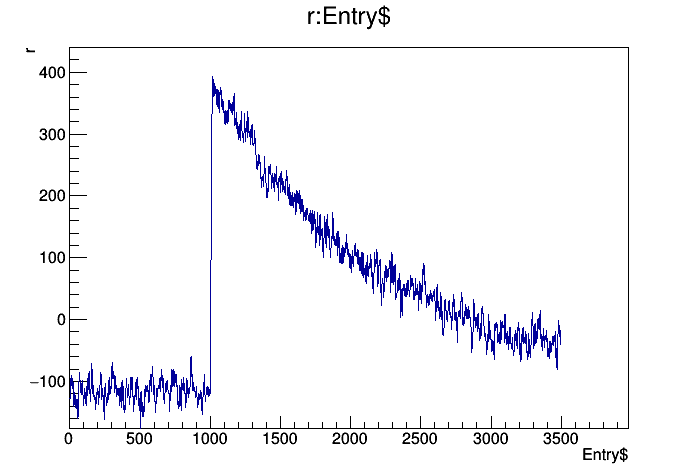

Pulse Generator
=================

C++ source code for tail pulse generation for use with Nab simulation and analysis software. The user has the ability to quickly produce a synthetic tail pulse, generated from a user-defined semi-gaussian current pulse, or to run a monte carlo simulation to transport charge carriers through a volume of silicon to produce a simulated current pulse. Once generated, the current pulse is integrated to determine total charge deposited, and the resultant pulse shape is then run through a CR-(RC)^2 shaper to produce a typical output pulse. Additionally, the project contains the functionality to solve for the 3D weighting and drift potentials, and data for determining parameters such as carrier drift velocities.

## Getting Started

The code can be compiled and integrated into a "main" function using the following commands:

```
$ make clean
$ make
```

*Note that the library may be properly linked as -lfftw instead of -lfftw3 as indicated in the Makefile*

An example synthetic waveform (not simulated based on physics) looks like this:


### Prerequisites

This code was compiled and tested on Ubuntu 14.04.4 with GNU Make 3.81 and GCC 4.8.4 using the C++11 standard. Additionally, the FFTW libraries are required, and can be installed from www.fftw.org.

## Acknowledgments

This material is based upon work supported by the U.S. Department of Energy, Office of Science, Office of Nuclear Physics under Award Number DE-SC0014622.

## Contributing Authors

Source code written by Aaron Jezghani.

## Copyright and license

Copyright 2018 University of Kentucky. All rights reserved.

